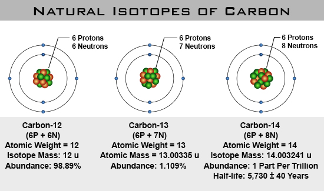

# Neutrons
Neutrons are the glue that hold the nucleus together.
They act as 'spacers' to keep the protons separated just enough that the **nuclear forces** can overcome the **electric forces** that are trying to push the **protons** apart.

| Mass | Charge    | Location |
|------|--------   |----------|
| 1 u  | 0 or none | Nucleus |

## Isotopes
**Protons** determine the element, but **neutrons** determine the **isotope**.
An **isotope** is an element that has the **atomic mass** specified, '[Element]-[Atomic Mass]'.
If no number is specified, it is assumed that you are referring to a bunch of atoms, the **element**.
If you specify the **atomic mass**  you are referring to an individual atom, or a collection of homogeneous atoms (atoms that are the same).

Examples:

  * Carbon is a element.
  * Carbon-12 is an **isotope** that has an **atomic mass** of 12.
  * Carbon-13 is an **isotope** that has an **atomic mass** of 13.
  * Carbon-14 is an **isotope** that has an **atomic mass** of 14.

In nature, **isotopes** occur in certain percentages depending upon how stable a given **isotope** is.

As seen above carbon comes in 3 types; Carbon-12, Carbon-13, and Carbon-14.
When referred to as Carbon-12, just the atom that has an **atomic mass** of 12 is being referred to.
When referred to as carbon it means that you have a mixture of all carbon isotopes in a given bulk material.

## Application - Carbon Dating
When alive, living things are constantly turning over the carbon in their bodies with the carbon in their environment through respiration (breathing) and the food they eat.
When living things die the carbon getting exchanged with their environment.
This means that when alive, all things have the same percentage of carbon-14 as their environment.

So when something dies the carbon-14 starts to decay because it is radioactive, meaning it is unstable and will spontaneously break down at a known rate.
We can then determine how old something is by how little carbon-14 is left when we examine it.

