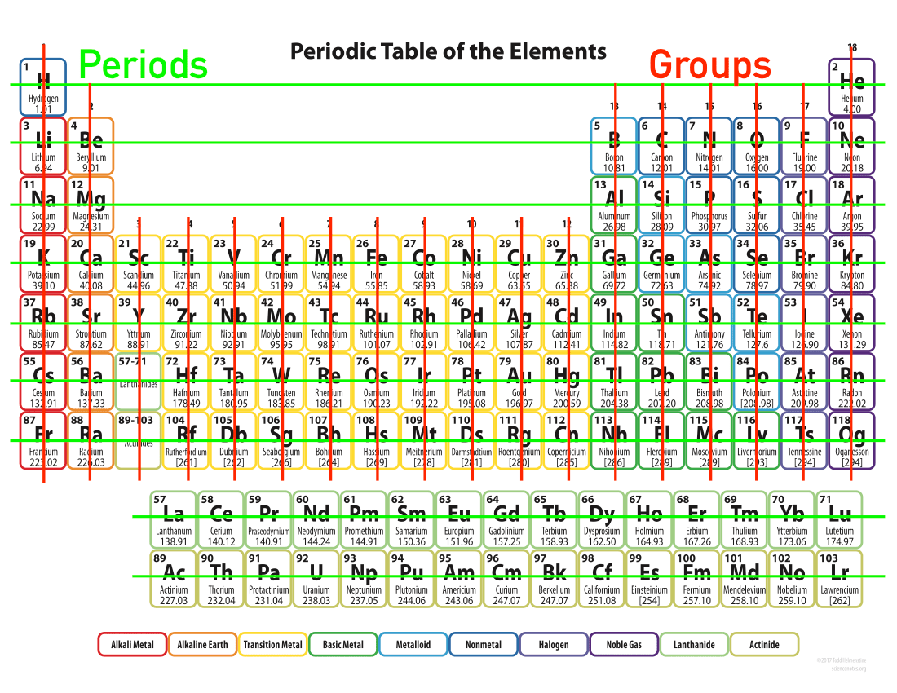
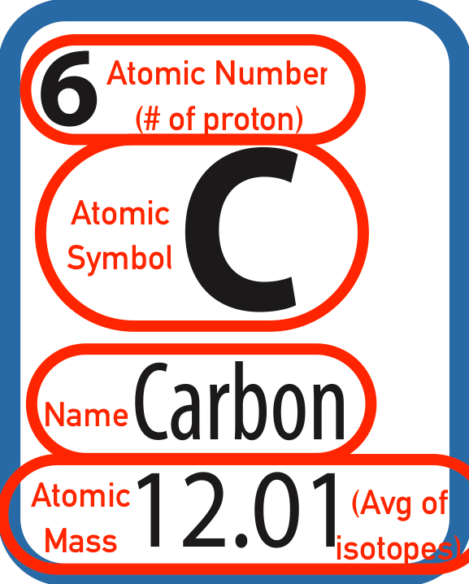
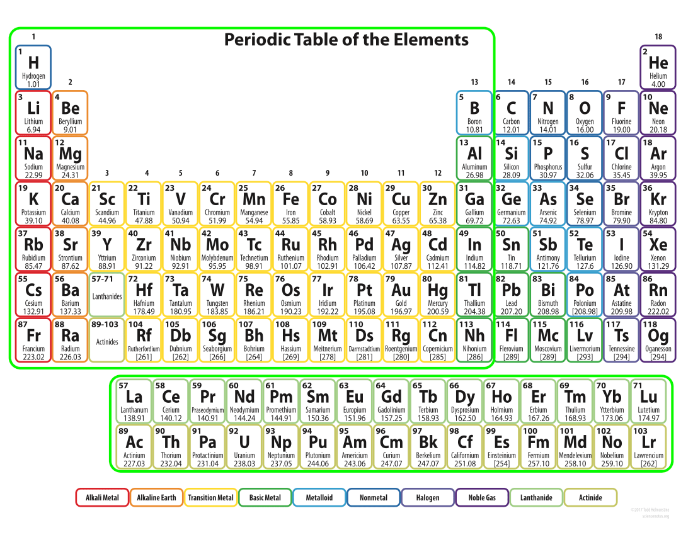
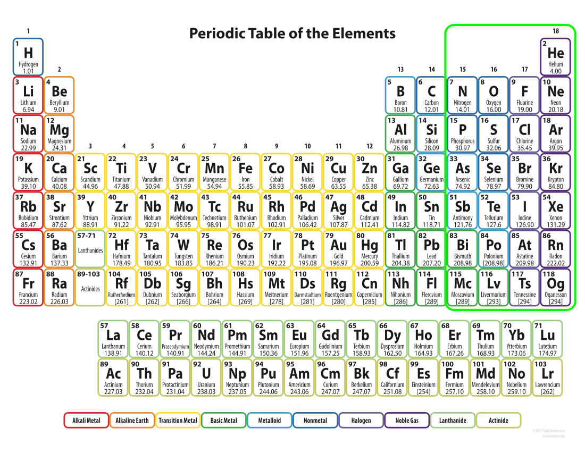
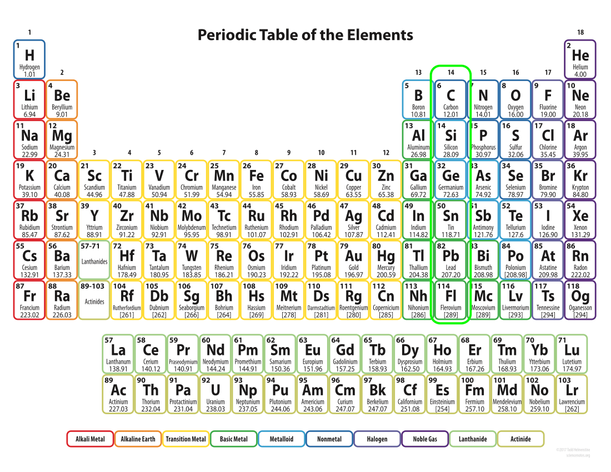

# Periodic Table
The periodic table was created by Dmitri Mendeleev to arrange and predict the properties of all the know elements.
Mendeleev arranged the elements into periods (rows) that was later discovered to mirror the **energy levels** of the atoms themselves.
His arrangement proved to be so useful that it corrected some of the properties of the known elements and predicted the existence and properties of undiscovered elements!

## Reading the Periodic Table
The periodic table has special names for the rows and columns because both the rows and columns relate to the structure of the atom.

### Periods
The **periods** correlate with the different **energy levels** of the atoms.
Properties of elements within a given period vary greatly.
The 1st **period** has 2 elements because the first **energy level** can hold 2 **electrons**.
The 2nd **period** has 8 elements because the 2nd **energy level** holds 8 **electrons**.
The 3rd **period** has 8 elements too because despite the fact that the 3rd **energy level** holds 18 electrons, it is happy when it has 8.
This is where the more complicated **orbital** model makes more sense than the model of concentric **energy levels**.

*Remember, for the purpose of this class, orbitals and energy levels are interchangeable, but out in the big world of physics, they refer to 2 different models of the atom*

### Groups
The **groups** of the periodic table correlate with the **valence electron** structure (with the exception of the metals in groups 3-12).

|Group Number| Valence Electrons|
|:---:|:---:|
|1 |1 |
|2 | 2|
|13 | 3|
| 14| 4|
| 15| 5|
| 16| 6|
| 17| 7|
| 18| 8|

Properties of elements within a given **group** are similar, because the **valence electrons** are the face the atom shows the world.
Meaning that to the world, atoms in a given **group** look similar.

The groups behave so similarly that some of the groups have special names.

| Group | Name |
|:-------:|:------:|
| 1 | Alkali Metals |
| 2 | Alkaline Earth Metals |
| 17 | Halogens |
| 18 | Noble Gases |

#### Alkali Metals
All of the **Alkali Metals** want very badly to get rid of their extra electron.
The farther down you go (lithium, sodium, etc.) the more violently they try to get rid of their electron.
When sodium comes into contact with water, it fizzles and gives off sparks.
When potassium comes into contact with water it explodes.
When cesium comes into contact with air it reacts violently with the moisture in the air, and explodes.
Francium is so reactive it is almost impossible to isolate in a pure form.

They are so reactive that the only occur in nature as compounds with other elements.

#### Alkaline Earth Metals
Being neighbors to the **alkali metals** the **alkaline earth metals** behave similarly but are a little heavier, a little denser, and a lot more stable.
All of the **alkaline earth metals** can be found in their pure form in nature.

#### Halogens
**Halogens** are very reactive (they *really* want that last electron) and are often found in salts.
The structure of larger atoms is more cumbersome so the reactivity of the **halogens** decreases as you move down the column.
Fluorine is the most reactive, chlorine slightly less reactive, and so on down the line.

#### Noble Gases
**Noble gases** are living their best life.
They want nothing to do with other elements because they have all the electrons they could want.
They are non-reactive, and rarely found in compounds.
Helium is so non-reactive that it will NOT form a solid even at 0K!
Noble gases are best know for their ionizing colors; neon is red, argon is pink, krypton is blue, and xenon is purple/white.
Mix the gases together in different concentrations and you get the different colors of neon signs!

## Parts of an Elements Square

  
  * **Atomic Number:** The identifier of the element AND the number of **protons**. The number of **protons** is what defines a given element.  **Electrons** and **neutrons** can vary (**ions** and **isotopes**) but the element is still the same.

  * **Atomic Symbol:** The letter(s) that are used as a symbol for the element.  Based on either English or Latin.
  * **Name:** The name of the element
  * **Atomic Mass:** The average mass of all the **isotopes** of a given element, as they occur in nature.  (*Recall, the isotope is defined as the mass of a given atom, example C-12 has a mass of 12, and since it has 6 protons, it must have 6 neutrons*)

## Broad Classification of Elements
Classically, the elements are divided in to a handful of different classes based on various properties.
For simplicity we are only going to break the table down in to three parts; conductors, semi-conductors, and non-conductors.
Also for simplicity, we are going to define the split between our classifications based on groups.
In actually the split is a diagonal line of elements called 'metalloids' starting with boron and ending with polonium.

### Conductors - (Metals)
Nearly all of the elements in **groups** 1-13 are **conductors** of electricity.
They all have extra **electrons** they are willing to share, and are thus able to freely conduct electricity.
The free **electrons** interact with light to give most all of them a shiny metallic appearance.

### Non-conductors
All of the **non-conductors** either want **electrons** or have enough so there are no **electrons** free to conduct electricity.
Most are gasses.

### Semi-conductors
Sitting in between we have the **semiconductors**.
They can be convinced to either be conductors or non-conductors depending upon their environment.

