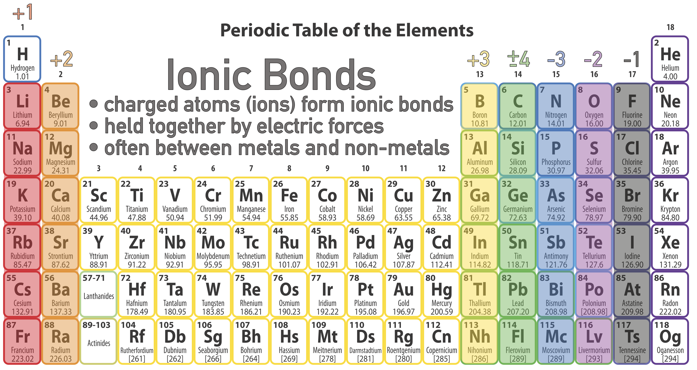
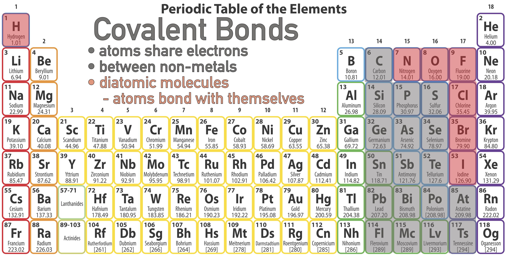

# Chemistry
For the purpose of this class we are concerned with taking the information we learned about the atoms and the periodic table and making simple molecules, understanding the basic properties of **ionic**, **colvalent**, and **metallic** bonds.
This we call chemistry.

#Chemical Reactions
Insert information from the lecture on chemical reactions

#Bonds
## Ionic bonds
**Ionic bonds** are a two stage process, first one element (usually a metal) gives up an electron or two forever and becomes a positive ion.

**Ionic bonds** form between an metal and non-metal (usually) because metals are the only atoms willing to give up electrons.

Examples:

  * $$\text{Na} \rightarrow \text{Na}^{1+}$$ when it gives up its spare unwanted electron.
  * $$\text{F} \rightarrow \text{F}^{1-}$$ when it steals an electron.

The second stage is now that there are two charged atoms (**ions**), they are attracted together by **electric forces**.
**Electric forces** then forever bind the two together.

Position on the periodic table predicts what **ions** the atoms will form, based on how many electrons the atoms would have to either give-away or steal to have the requisite 8 valence electrons (or 2).

## Covalent Bonds
**Covalent bonds** form when atoms decide to share electrons rather than outright give-away or steal.

**Covalent bonds** occur between non-metals because neither party is willing to give up their electrons.

Examples (Diatomic molecules):

  * Hydrogen has 1 electron, but wants 2. So when one hydrogen meets another, they come to an agreement to each contribute their 1 electron to a shared pool.  Now the pool has 2 electrons and each atom pulls from the pool so each atom feels that it has 2 electrons.

  
  * Oxygen has 6 **valence electrons** but wants 8, so it needs to share 2 electrons with someone. When oxygen sees another oxygen, they cut a deal where each throws 2 electrons in to a share pool (meaning there are 4 in the share pool).  With the 4 remaining, and the 4 in the share pool, each oxygen has 8 and they are both happy.

The notation is called **Lewis Dot Structures** and is explained in more detail below.

### Lewis Dot Structures
**Lewis Dot Structures** show the valanece electrons a given atom has.

The goal of every atom is to have 8 valence electrons, so they will share to reach that goal.

